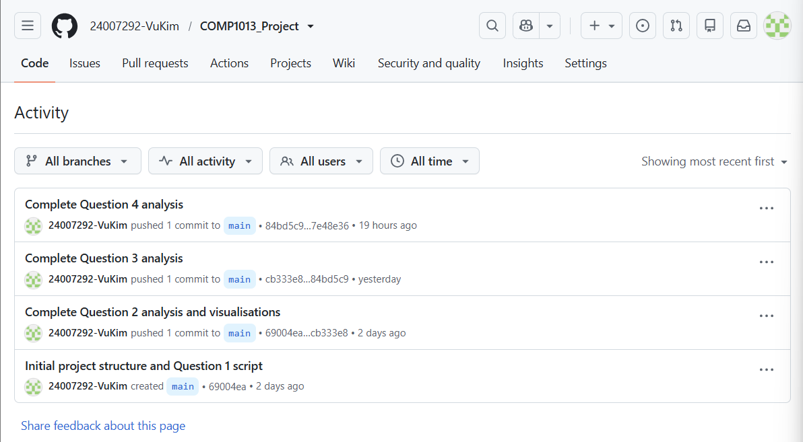

```{r setup, include=FALSE}
knitr::opts_chunk$set(echo = TRUE)
```

```{r, echo=FALSE, out.width="25%", fig.align="center"}

```

# **Table of Contents**
1. Introduction

2. Question 1 – Data Inspection, Cleaning and Visualisation

3. Question 2 – Distribution of Home Team Scores

4. Question 3 – Analysis of Penalty Shootout Teams

5. Question 4 – Match Results Analysis

6. GitHub Repository

7. Conclusion


\newpage
# Introduction

This report presents the analysis of ***FIFA World Cup match data*** using the **R programming language** and the **tidyverse** package in **RStudio**.

The assignment aims to demonstrate the following **data analysis skills**:

- **Importing and preparing datasets**
- **Exploring variables**
- **Summarising information**
- **Creating appropriate data visualisations**

Four questions are completed using the FIFA World Cup datasets to investigate **match statistics** and **team performance**.

In addition, **Git** and **GitHub** are used for **version control**, allowing the development process to be tracked through meaningful commits.

The report presents the **R code**, **analysis**, **visualisations**, and **results** for each question in a clear, logical, and well-structured format.
 
\newpage
# Question 1 – Data Inspection, Cleaning and Visualisation
## Objective
Write the code to inspect the data structure and present the data: The missing values in the dataset were written as "?", replace any "?" with NA; Convert categorical variables Result, Stage, Country, and Extratime to factors; Convert variables HomePenalty and AwayPenalty to numeric format and replace the missing values with 0; Select an appropriate chart type to visualize the distribution of HomePenalty for matches that involved a penalty shootout. Briefly justify your choice and interpret the resulting plot.

## R Code
```{r}
library(tidyverse)

###############################################################
# PART B - Import and Inspect the datasets
###############################################################

# Read the Matches dataset.
# This dataset contains information about every FIFA World Cup
# match.

matches <- 
  read.csv(
    "data/Matches.csv",
           stringsAsFactors = FALSE
           )

# Read the Teams dataset.
# This dataset stores the country name and FIFA team code.

teams <-
  read.csv(
    "data/Teams.csv",
    stringsAsFactors = FALSE
  )
  
# Read the Stadiums dataset.
# This dataset stores stadium locations.

stadiums <-
  read.csv(
    "data/Stadiums.csv",
    stringsAsFactors = FALSE 
  )

# Read the Tournament dataset.
# This dataset contains tournament editions.

tournaments <- 
  read.csv(
    "data/Tournaments.csv",
    stringsAsFactors = FALSE
  )

###############################################################
# Inspect the datasets
###############################################################

# Display the first six rows to understand the structure.

head(matches)

head(teams)

head(stadiums)

head(tournaments)

# Display the structure of each dataset.

str(matches)

str(teams)

str(stadiums)

str(tournaments)

# Display summary statistics and detect possible missing values.

summary(matches)

summary(teams)

summary(stadiums)

summary(tournaments)

###############################################################
# PART C - Clean the data
###############################################################


###############################################################
# Step 1: Check missing values represented by "?"
###############################################################

# Count the number of "?" values in each dataset.

# Count the number of "?" values in the Matches dataset.
sum(matches == "?", na.rm = TRUE)

# Count the number of "?" values in the Stadiums dataset.
sum(stadiums == "?", na.rm = TRUE)

###############################################################
# Step 2: Replace "?" with NA
###############################################################

# Replace all occurrences of "?" with NA.
# NA is the standard representation of missing values in R.
# Replace all "?" values with NA so that R recognises
# them as missing values.

matches[matches == "?"] <- NA

stadiums[stadiums == "?"] <- NA

# Verify that all "?" values have been removed.

sum(matches == "?", na.rm = TRUE)

sum(stadiums == "?", na.rm = TRUE)

###############################################################
# Step 3: Convert categorical variables into factors
###############################################################

# Result contains categorical values.

matches$Result <-
  factor(matches$Result)

# Stage contains competition stages.

matches$Stage <-
  factor(matches$Stage)

# ExtraTime contains 2 categorical values (0 and 1).

matches$ExtraTime <-
  factor(matches$ExtraTime)

# Country is a categorical variable.

stadiums$Country <-
  factor(stadiums$Country)

# Check the updated data types.

str(matches)
str(stadiums)

###############################################################
# Step 4: Convert penalty variables into numeric
###############################################################

# Convert HomePenalty into numeric.

matches$HomePenalty <-
  as.numeric(matches$HomePenalty)

# Convert AwayPenalty into numeric.

matches$AwayPenalty <-
  as.numeric(matches$AwayPenalty)

###############################################################
# Step 5: Replace missing penalty values with zero
###############################################################

# Missing values indicate no penalty goals.

matches$HomePenalty[
  is.na(matches$HomePenalty)
] <- 0

matches$AwayPenalty[
  is.na(matches$AwayPenalty)
] <- 0

###############################################################
# Step 6: Check the cleaned data
###############################################################
str(matches)

summary(matches$HomePenalty)

summary(matches$AwayPenalty)

sum(is.na(matches$HomePenalty))

sum(is.na(matches$AwayPenalty))


###############################################################
# PART D - Prepare the data for visualisation
###############################################################

###############################################################
# Check values of PenaltyShootout
###############################################################

# Display the number of matches with and without
# a penalty shootout.

table(matches$PenaltyShootout)

# The value 1 indicates that the match
# was decided by a penalty shootout.

###############################################################
# Filter matches decided by penalty shootout
###############################################################

# Filter the dataset to include only matches
# decided by a penalty shootout.
# Store the filtered data in a new object
# for plotting.
penalty_matches <-
  matches %>%
  filter(PenaltyShootout == 1)


###############################################################
# PART E - Create the visualisation
###############################################################

# A histogram is used because HomePenalty is a
# numerical variable and the chart clearly shows
# the distribution of penalty goals.

ggplot(
  penalty_matches,
  aes(
    x = HomePenalty
  )
) +
  geom_histogram(
    binwidth = 1,
    colour = "black",
    fill = "steelblue"
  ) +
  labs(
    title = "Distribution of Home Penalty Goals",
    x = "Home Penalty Goals",
    y = "Number of Matches"
  ) +
  theme_minimal()
```
**Figure 1. **Distribution of Home Penalty Goals.

```{r}
###############################################################
# PART F - Validate the results
###############################################################

# Check data types

str(matches)

# Check summary statistics

summary(matches)

#Check penalty values

summary(matches$HomePenalty)

summary(matches$AwayPenalty)

# Check filtered data

head(penalty_matches)

getwd()

```

\newpage
# Question 2 – Home Team Score Analysis

## Objective

Write the code to analyse the distribution of HomeTeamScore across different competition stages 
(Stage) and tournament name (TournamentName). Then, write the code to investigate the 
distribution of HomeTeamScore across the following groups of AwayTeamScore (e.g., 0-1 goals, 2-3 
goals, 4 or more goals). Visualise the findings using histograms and briefly explain your observations. 


## R Code
 ### Data Preparation
```{r}
 # PART A - Load required packages
###############################################################
library(tidyverse)

###############################################################
# PART B - Import and prepare the datasets
###############################################################
# Read the Matches dataset.
# This dataset contains match scores and competition stages.

matches <- 
  read.csv(
    "data/Matches.csv",
    stringsAsFactors = FALSE
  )

# Read the Tournament dataset.
# This dataset contains tournament names.

tournaments <- 
  read.csv(
    "data/Tournaments.csv",
    stringsAsFactors = FALSE
  )

###############################################################
# Merge datasets
###############################################################
# Merge Matches with Tournaments to obtain the tournament name.

matches_full <-
  matches %>%
  left_join(
    tournaments,
    by = "TournamentID"
  )

###############################################################
# Check merged dataset

# Display the first six rows.

head(matches_full)

# Display the data structure.
str(matches_full)

# Convert Stage and TournamentName into factors.
# Stage is a categorical variable.

matches_full$Stage <-
  factor(matches_full$Stage)

# TournamentName is a categorical variable.

matches_full$TournamentName <-
  factor(matches_full$TournamentName)

# Check the updated data types.

str(matches_full)

```

\newpage
## Distribution of Home Team Score by Competition Stage

```{r}
# PART C - Analyse HomeTeamScore by Stage and TournamentName
###############################################################

# Check Stage values
###############################################################

# Display the frequency of each competition stage.

table(matches_full$Stage)

###############################################################
# Create a histogram of HomeTeamScore by Stage
###############################################################
# A histogram is used because HomeTeamScore is a numerical variable 
# and the chart clearly shows its distribution.

ggplot(
  matches_full,
  aes(
    x = HomeTeamScore
  )
) +
  geom_histogram(
    binwidth = 1,
    colour = "black",
    fill = "steelblue"
  ) +
  facet_wrap(
    ~ Stage,
    ncol = 4,
    labeller = labeller(
      Stage = c(
        "group stage" = "Group Stage",
        "second group stage" = "Second Group Stage",
        "round of 16" = "Round of 16",
        "quarter-finals" = "Quarter-finals",
        "semi-finals" = "Semi-finals",
        "third-place match" = "Third-place Match",
        "final" = "Final",
        "final round" = "Final Round"
      )
    )
  ) +
  labs(
    title = "Distribution of Home Team Scores by Competition Stage",
    x = "Home Team Score",
    y = "Number of Matches"
  ) +
  theme_minimal() +
  theme(
    plot.title = element_text(
      face = "bold",
      hjust = 0.5
    ),
    strip.text = element_text(
      face = "bold"
    ),
    panel.grid.minor = element_blank()
  ) +
  scale_x_continuous(
    breaks = 0:10
  ) +
  scale_y_continuous(
    breaks = scales::pretty_breaks()
  )
```
**Figure 2. **Distribution of Home Team Scores by Competition Stage.

\newpage
## Distribution of Home Team Scores by Tournament

```{r}
# Check TournamentName values
###############################################################

# Display the frequency of each tournament.

table(matches_full$TournamentName)

###############################################################
# Create a histogram of HomeTeamScore by TournamentName
###############################################################
# A histogram is used because HomeTeamScore is a numerical variable and the chart
# clearly shows its distribution for each tournament.

ggplot(
  matches_full,
  aes(
    x = HomeTeamScore
  )
) +
  geom_histogram(
    binwidth = 1,
    colour = "black",
    fill = "darkseagreen3"
  ) +
  facet_wrap(
    ~ TournamentName,
    ncol = 4
  ) +
  labs(
    title = "Distribution of Home Team Scores by Tournament",
    x = "Home Team Score",
    y = "Number of Matches"
  ) +
  theme_minimal() +
  theme(
    strip.text = element_text(face = "bold"),
    plot.title = element_text(face = "bold", hjust = 0.5),
    axis.text = element_text(size = 8),
    pannel.grid.minor = element_blank()
  )    
```
**Figure 3.** Distribution of Home Team Scores by Tournaments.


## Distribution of Home Team Scores by Away Team Score Groups

```{r}
# PART D - Create AwayTeamScore groups
###############################################################

# Create a new variable to store AwayTeamScore groups.

matches_full$AwayScoreGroup <- NA

# Group matches where the away team scored 0 or 1 goal.

matches_full$AwayScoreGroup[
  matches_full$AwayTeamScore <= 1
] <- "0-1 goals"

# Group matches where the away team scored 2 or 3 goals.

matches_full$AwayScoreGroup[
  matches_full$AwayTeamScore >= 2 &
    matches_full$AwayTeamScore <= 3
] <- "2-3 goals"

# Group matches where the away team scored 4 or more goals.

matches_full$AwayScoreGroup[
  matches_full$AwayTeamScore >= 4
] <- "4+ goals"

###############################################################
# Check AwayTeamScore groups
###############################################################

# Display the number of matches in each AwayTeamScore group.

table(matches_full$AwayScoreGroup)
```
**Figure 4.** Distribution of Home Team Scores by Away Team Score Groups.

\newpage
## Validation
```{r}
# PART E - Create the visualisation
###############################################################

# Create a histogram of HomeTeamScore by AwayTeamScore groups
###############################################################

# A histogram is used because HomeTeamScore is a numerical variable and
# the chart clearly shows the distribution across AwayTeamScore groups.

ggplot(
  matches_full,
  aes(
    x = HomeTeamScore
  )
) +
  geom_histogram(
    binwidth = 1,
    colour = "black",
    fill = "lightblue"
) +
facet_wrap(
  ~ AwayScoreGroup
) +
  labs(
    title = "Distribution of Home Team Scores by Away Team Score Groups",
    x = "Home Team Score",
    y = "Number of Matches"
  ) +
  theme_minimal()
```
**Figure 4.** Distribution of Home Team Scores by Away Team Score Groups.


```{r}
###############################################################
# PART F - Validate the results
###############################################################

# Check the structure of the dataset.

str(matches_full)

# Check summary statistics.

summary(matches_full)

# Check the AwayTeamScore groups.

table(matches_full$AwayScoreGroup)
```

\newpage
# Question 3 – Penalty Shootout Analysis

## Objective
Filter out the matches that were decided by a penalty shootout. What are the top 5 national teams that 
most frequently participated in these matches? Do the rankings differ between home teams and away 
teams? Provide separate tables containing the columns TeamName, TeamCode, and 
NumberOfMatches, showing the top 5 home teams and top 5 away teams involved in penalty 
shootouts. Briefly discuss your findings. 

## Data Preparation

```{r}
# PART A - Load required packages
###############################################################

library(tidyverse)

###############################################################
# PART B - Import and prepare the datasets
###############################################################

# Read the Matches dataset.

matches <-
  read.csv(
    "data/Matches.csv",
    stringsAsFactors = FALSE
  )

# Read the Teams dataset.

teams <- 
  read.csv(
    "data/Teams.csv",
    stringsAsFactors = FALSE
  )


###############################################################
# PART C - Filter penalty shootout matches
###############################################################

# Only keep matches decided by a penalty shootout.

penalty_matches <-
  matches %>%
  filter(
    PenaltyShootout == 1
  )

###############################################################
# Check the filtered dataset
###############################################################

# Display the first six rows.

nrow(penalty_matches)
```

## Top Five Home Teams

```{r}
# PART D - Top 5 Home Teams
###############################################################

# Merge penalty matches with the Teams dataset to obtain the home team name and code.

home_matches <-
  penalty_matches %>%
  left_join(
    teams,
    by = c("HomeTeamID" = "TeamID")
  )

###############################################################
# Check merged dataset
###############################################################

# Display the first six rows.

head(home_matches)


###############################################################
# PART E - Identify the top five home teams
###############################################################

###############################################################
# Count the number of matches for each home team and sort the results in order.
###############################################################

home_summary <-
  home_matches %>%
  group_by(
    TeamName,
    TeamCode
  ) %>%
  summarise(
    NumberOfMatches = n()
  ) %>%
  arrange(
    desc(NumberOfMatches)
  )

###############################################################
# Select the top five home teams
###############################################################

top5_home <-
  head(
    home_summary,
    5
  )

###############################################################
# Display the top five home teams
###############################################################

top5_home
```
The results identify the **five home teams** that most frequently participated in FIFA World Cup matches decided by penalty shootouts. The analysis was selected by joining the **Matches** and **Teams** datasets to obtain team names, grouping the matches by team, counting the number of appearances, and sorting the results in descending order. These results indicate which teams have most often reached knockout matches that required penalty shootouts.

\newpage
## Top Five Away Teams

```{r}
# PART F - Identify the top five away teams
###############################################################

###############################################################
# Merge penalty matches with the Teams dataset
###############################################################

# Merge penalty matches with the Teams dataset to obtain the away team name and code.

away_matches <-
  penalty_matches %>%
  left_join(
    teams,
    by = c("AwayTeamID" = "TeamID")
  )

###############################################################
# Check merged dataset
###############################################################

# Display the first six rows.

head(away_matches)


###############################################################
# Count the number of matches for each away team
###############################################################

# Count the number of matches for each away team and sort the results in order.

away_summary <-
  away_matches %>%
  group_by(
    TeamName,
    TeamCode
  ) %>%
  summarise(
    NumberOfMatches = n()
  ) %>%
  arrange(
    desc(NumberOfMatches)
  )

###############################################################
# Select the top five away teams
###############################################################

top5_away <-
  head(
    away_summary,
    5
  )

###############################################################
# Display the top five away teams
###############################################################

top5_away
```
## Discusion
A similar procedure was applied to identify the **top five away teams** in penalty shootout matches. The findings show which teams most frequently appeared as the away team in these matches. Together with the home team analysis, the results provide a clearer understanding of the teams that have regularly competed in high-pressure knockout matches requiring penalty shootouts.

## Validation

```{r}
# PART G - Validate the results
###############################################################

# Check the structure of the home team summary.

str(home_summary)

# Check the structure of the away team summary.

str(away_summary)

# Display the top five home teams.

top5_home

# Display the top five away teams.

top5_away
```

\newpage
# Question 4 – Factors Influencing Match Results

## Objective
Write the code to analyse the factors that might influence the match outcome (Result) in the FIFA 
World Cup dataset. The Result variable consists of three categories: Home Team Win, Away Team 
Win, and Draw. Any factors in the dataset, such as Stage,  ExtraTime, and Country, can be considered. 
Select two factors and investigate whether there are any trends that explain variations in match 
outcomes. Support your analysis with appropriate tables and visualisations, and briefly discuss your 
findings.

## Data Presentation

```{r}
# PART A - Load required packages
###############################################################

library(tidyverse)


###############################################################
# PART B - Import and prepare the dataset
###############################################################
# Read the Matches dataset.
# This dataset contains match scores and match characteristics.

matches <-
  read.csv(
    "data/Matches.csv",
    stringsAsFactors = FALSE
  )

###############################################################
# Check the dataset
###############################################################

# Display the first six rows.

head(matches)

#Display the structure of the dataset.

str(matches)


###############################################################
# PART C - Prepare the dataset
###############################################################

# Convert Stage into a factor. Stage is a categorical variable.

matches$Stage <-
  factor(
    matches$Stage,
    levels = c(
      "group stage",
      "second group stage",
      "round of 16",
      "quarter-finals",
      "semi-finals",
      "third-place match",
      "final",
      "final round"
    )
  )

# Convert ExtraTime into a factor. ExtraTime contains two categories (0 and 1).

matches$ExtraTime <-
  factor(matches$ExtraTime)

# Convert Result into a factor. Result contains the match outcome categories.

matches$Result <-
  factor(matches$Result)

###############################################################
# Check the updated data types
###############################################################

# Display the structure of the dataset.

str(matches)
```

\newpage
## Match Results by Competition Stage

```{r}
# PART D - Explore match results by Stage
###############################################################

# Check Stage values
###############################################################

# Display the number of matches in each competition stage.

table(matches$Stage)


###############################################################
# PART E - Create the first visualisation
###############################################################

# Create a bar chart of match results by competition stage.
# A bar chart is used because Stage and Result are categorical variables.
# The chart clearly compares the number of match results across competition stages.

ggplot(
  matches,
  aes(
    x = Stage,
    fill = Result
  )
) +
  geom_bar(
    position = "dodge"
  ) +
  labs(
    title = "Match Results by Competition Stage",
    x = "Competition Stage",
    y = "Number of Matches",
    fill = "Match Result"
  ) +
  theme_minimal() +
  theme(
    axis.text.x = element_text(
      angle = 45,
      hjust = 1
      
    )
  ) +
  scale_x_discrete(
    labels = c(
    "final" = "Final",
    "final round" = "Final Round",
    "group stage" = "Group Stage",
    "quarter-finals" = "Quarter-finals",
    "round of 16" = "Round of 16",
    "second group stage" = "Second Group Stage",
    "semi-finals" = "Semi-finals",
    "third-place match" = "Third-place Match"
  )
) +
  scale_fill_discrete(
    labels = c(
      "away team win" = "Away Team Win",
      "draw" = "Draw",
      "home team win" = "Home Team Win"
    )
  )
```
**Figure 5.** Match Results by Competition Stage.

\newpage
## Discussion
The bar chart shows the number of **home team wins**, **away team wins**, and **draws** at each stage of the FIFA World Cup. The **group stage** has the **highest** number of matches because it includes the most games in the tournament. The number of matches then <u>decreases<u> in the knockout rounds, leading to <u>fewer results<u> at each later stage. Overall, home team wins are **more common** than away team wins in most stages, while draws are **less frequent** since knockout matches must end with a winner.

\newpage
## Match Results by Extra Time

```{r}
# PART F - Create the second visualisation
###############################################################

# Create a bar chart of match results by extra time.
# A bar chart is used because ExtraTime and Result are categorical variables.
# The chart compares match results between matches with and without extra time.

ggplot(
  matches,
  aes(
    x = ExtraTime,
    fill = Result
  )
) +
  geom_bar(
    position = "dodge"
  ) +
  labs (
    title = "Match Results by Extra Time",
    x = "Extra Time",
    y = "Number of Matches",
    fill = "Match Result"
  ) + 
  theme_minimal() +
  scale_x_discrete(
    labels = c(
      "0" = "No",
      "1" = "Yes"
    )
  ) +
  scale_fill_discrete(
    labels = c(
      "away team win" = "Away Team Win",
      "draw" = "Draw",
      "home team win" = "Home Team Win"
    )
  )
```
**Figure 6.** Match Results by Extra Time.

## Discussion
The second bar chart compares match results between games that **did not require extra time** and those that **went to extra time**. Most FIFA World Cup matches were decided within regular time, so the **No** category contains far more matches than the **Yes** category. Across both groups, **home team wins** were the most common outcome. **Draws** were more frequent in matches that went to extra time because these games were <u>tied<u> at the end of regular time.


## Validation

```{r}
# PART G - Validate the results
###############################################################

# Display the structure of the dataset.

str(matches)

# Display the number of matches in each competition stage.

table(matches$Stage)

# Display the number of matches with and without extra time.

table(matches$ExtraTime)

# Display the number of each match result.

table(matches$Result)
```

\newpage
# GitHub Repository

## Objective

**Git** and **GitHub** were used throughout this assignment to manage *version control* and *document* the project's development. **Git** was used to track changes made to the project files, while **GitHub** served as the remote repository for storing and backing up the project. This section outlines the Git commands used, presents the commit history, and provides the link to the GitHub repository.


## GitHub Repository Link

**GitHub Repository:** https://github.com/24007292-VuKim/COMP1013_Project

## Git Command

| Git Command | Explanation |
|--------------|-------------|
| `git init` | Creates a new local Git repository. |
| `git status` | Displays the status of files in the repository. |
| `git add .` | Stages all modified files for the next commit. |
| `git commit -m "message"` | Saves the staged changes with a descriptive commit message. |
| `git remote add origin <repository-url>` | Connects the local repository to the remote GitHub repository. |
| `git push -u origin main` | Uploads the commits from the local repository to GitHub. |

\newpage
## Commit History

**Figure 7** shows the commit history recorded during the development of this assignment. Multiple commits were made throughout the project to document progress, track changes, and maintain version control during the analysis.

```{r commit-history, echo=FALSE, out.width="90%"}

```

**Figure 7.** Git Commit History

\newpage
# Conclusion
This report demonstrated the use of **R** and the **tidyverse** package to analyse FIFA World Cup data. The project followed the complete data analysis process, including importing, inspecting, and cleaning the data, transforming variables, creating visualisations, and interpreting the findings. Statistical graphs were used to explore match outcomes, competition stages, extra time, penalty shootouts, and team performance. In addition, **Git** and **GitHub** were used for version control, enabling the project's development to be tracked through meaningful commits. Overall, this assignment provided practices in data analysis, data visualisation, report performing with **R Markdown**, and project management using Git, strengthening the key skills developed throughout the COMP1013 course.


